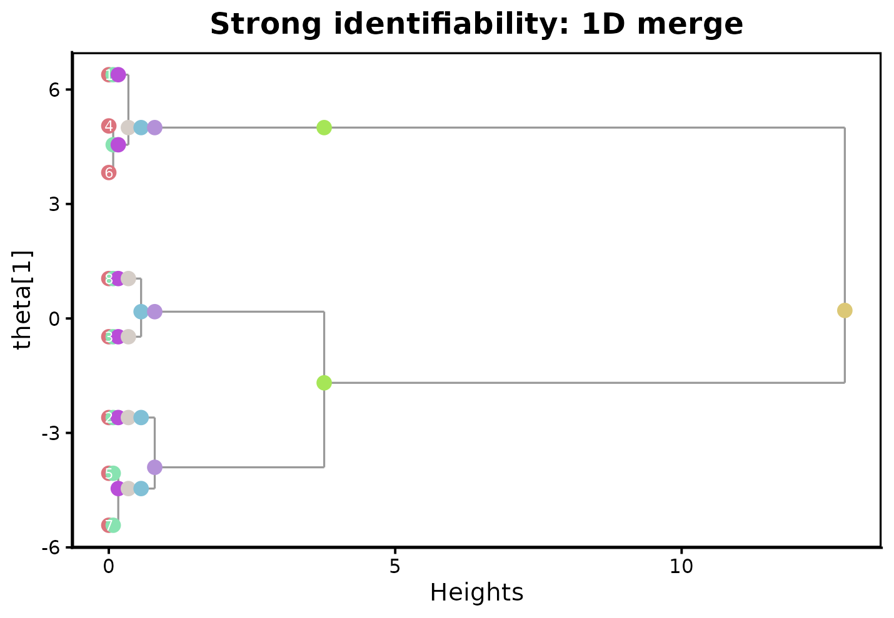
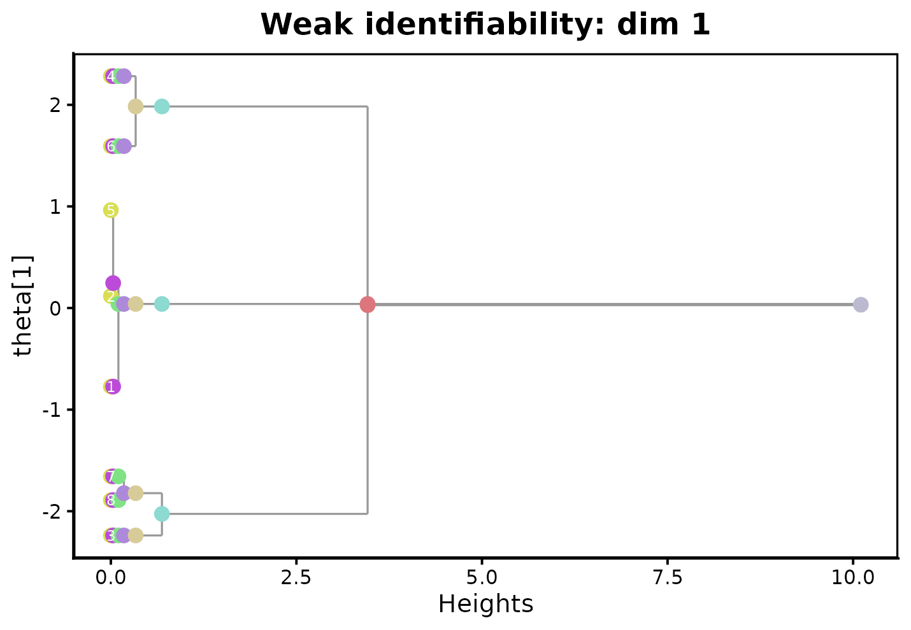
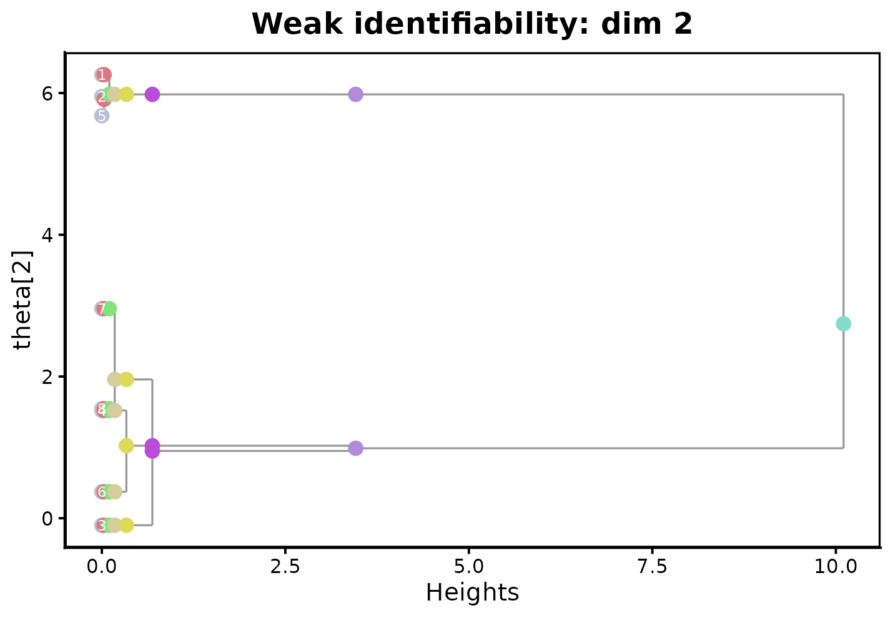

# Getting started with dendroMixR

## The problem this package solves

Fitting a finite mixture model requires choosing the number of
components $`k`$. In practice $`k`$ is unknown, so it is common to
*overfit* on purpose: fit with more components than you believe are
really there, then try to make sense of the result. Unfortunately,
overfitted mixture models come with a real statistical cost. Parameter
estimates for an overfitted mixing measure converge much more slowly
than for a correctly-specified one — as slowly as $`n^{-1/8}`$ for some
Gaussian mixtures — and the fit typically contains redundant,
near-duplicate components that are hard to interpret.

`dendroMixR` implements the method from Do, Do, McKinley, Terhorst, and
Nguyen, *“Dendrogram of mixing measures: Hierarchical clustering and
model selection for finite mixture models”* (Biometrika, 2025). The idea
is to take a single overfitted fit and repeatedly merge its two most
similar components (its “atoms”), producing a nested sequence of mixing
measures with $`k, k-1, \dots, 1`$ components — much like agglomerative
hierarchical clustering, but applied to mixture atoms rather than data
points. The paper shows that this merging procedure recovers the fast,
root-$`n`$ convergence rate at the true number of components, even
though the starting overfitted fit converged slowly, and it does so
without ever re-fitting the model.

This vignette shows the two core functions in action:

- [`dendrogram_mixing()`](https://dodat-stats.github.io/dendroMixR/reference/dendrogram_mixing.md)
  performs the merging and returns a hierarchical clustering object
  (`hc`), the sequence of intermediate mixing measures (`Gs`), and the
  merge history (`merge_pair`).
- [`plot_dendrogram_mixing()`](https://dodat-stats.github.io/dendroMixR/reference/plot_dendrogram_mixing.md)
  visualizes the result as a dendrogram, with one parameter dimension
  shown at a time.

``` r

library(dendroMixR)
```

## A minimal worked example

Before working with simulated data, it helps to see
[`dendrogram_mixing()`](https://dodat-stats.github.io/dendroMixR/reference/dendrogram_mixing.md)
on a small, hand-built mixing measure so the mechanics are clear. Here
are six atoms in one dimension, arranged so that atoms 1-2, 3-4, and 5-6
are each close together (as if an EM fit had produced redundant
near-duplicate components near three “true” locations at roughly $`-2`$,
$`0`$, and $`3`$):

``` r

ps_toy     <- c(0.05, 0.30, 0.05, 0.30, 0.15, 0.15)
thetas_toy <- c(-2.1, -1.9, 0.05, -0.05, 3.0, 3.2)

dmm_toy <- dendrogram_mixing(ps_toy, thetas_toy)
str(dmm_toy, max.level = 1)
#> List of 3
#>  $ hc        :List of 5
#>   ..- attr(*, "class")= chr "hclust"
#>  $ Gs        :List of 6
#>  $ merge_pair: int [1:5, 1:2] 3 1 3 1 1 4 2 4 2 2
```

`dmm_toy$hc$height` gives the dissimilarity at which each merge
happened. Because atoms 1-2, 3-4, and 5-6 are near-duplicates, we expect
the first few merges to happen at a much smaller height than the later
ones that join genuinely distinct components:

``` r

dmm_toy$hc$height
#> [1] 0.0004285714 0.0017142857 0.0030000000 0.6270089286 3.4994169643
```

The heights jump by roughly two orders of magnitude between the third
and fourth merges — exactly the pattern we’d want, since the first three
merges clean up redundant atoms while the last two join real, separated
components.

## Example 1: strongly identifiable mixtures (known variance)

When the component variance is known and shared across components (the
*strongly identifiable* case),
[`dendrogram_mixing()`](https://dodat-stats.github.io/dendroMixR/reference/dendrogram_mixing.md)
only needs weights and means: `sigmas = NULL`. This case also covers the
common practice of overfitting via a hard-clustering method such as
$`k`$-means, which implicitly assumes equal, fixed variance across
clusters.

We simulate data from a well-separated 3-component 1-D Gaussian mixture
with unit variance, then deliberately overfit with $`k = 8`$ clusters:

``` r

n   <- 2000
ps0 <- c(0.3, 0.4, 0.3)
mu0 <- c(-4, 0, 5)
k0  <- 3

z <- sample(k0, n, replace = TRUE, prob = ps0)
x  <- rnorm(n, mu0[z], sd = 1)

k_over <- 8
km <- kmeans(x, centers = k_over, nstart = 20)
ps_over    <- as.numeric(table(km$cluster)) / n
theta_over <- as.numeric(km$centers)
```

Now merge the overfitted fit down with
[`dendrogram_mixing()`](https://dodat-stats.github.io/dendroMixR/reference/dendrogram_mixing.md):

``` r

dmm1 <- dendrogram_mixing(ps_over, theta_over)
dmm1$hc$height
#> [1] 0.07689073 0.08837710 0.17687009 0.22175558 0.23793065 2.95811472 9.08888408
```

`dmm1$Gs` holds the mixing measure at every level of the tree, from
$`k = 8`$ atoms down to $`k = 1`$. Cutting at the true $`k_0 = 3`$
(`Gs[[k_over - k0 + 1]]`) recovers weights and means very close to the
truth (0.3/0.4/0.3 and $`-4, 0, 5`$), even though no re-fitting took
place:

``` r

merged3 <- dmm1$Gs[[k_over - k0 + 1]]
merged3$ps
#> [1] 0.2835 0.3275 0.3890
merged3$thetas
#> [1]  5.0022964 -3.9013129  0.1775128
```

[`plot_dendrogram_mixing()`](https://dodat-stats.github.io/dendroMixR/reference/plot_dendrogram_mixing.md)
visualizes the merge sequence. Each column of points is one level of the
tree ($`k`$ atoms down to 1); tracing the gray branches from left to
right shows which atoms combine and at what height:

``` r

plot_dendrogram_mixing(dmm1, main = "Strong identifiability: 1D merge")
```



## Example 2: weakly identifiable mixtures (location-scale Gaussian)

Location-scale Gaussian mixtures — where both the mean *and* the
covariance are estimated — are *weakly identifiable* and are known to
have especially slow convergence when overfitted. Pass a `sigmas`
argument (a list of covariance matrices for multivariate data, or a
numeric vector of variances in 1-D) to use the weak-identifiability
merge rule.

We simulate 2-D data from three Gaussians with different covariance
structures and fit an overfitted $`k=8`$ Gaussian mixture with `mclust`:

``` r

library(mclust)
#> Package 'mclust' version 6.1.3
#> Type 'citation("mclust")' for citing this R package in publications.

n <- 1500
ps0  <- c(1/3, 1/3, 1/3)
mus0 <- matrix(c( 2, 1,
                   0, 6,
                  -2, 1), nrow = 3, byrow = TRUE)
sigmas0 <- list(
  matrix(c(0.50,  0.30,  0.30, 1.00), 2, 2),
  matrix(c(0.50, -0.10, -0.10, 0.10), 2, 2),
  matrix(c(0.25,  0.30,  0.30, 2.00), 2, 2)
)
k0 <- 3

z <- sample(k0, n, replace = TRUE, prob = ps0)
x <- matrix(0, n, 2)
for (i in seq_len(n)) x[i, ] <- MASS::mvrnorm(1, mus0[z[i], ], sigmas0[[z[i]]])

k_over <- 8
fit <- Mclust(x, G = k_over, modelNames = "VVV", verbose = FALSE)

ps_over     <- fit$parameters$pro
mus_over    <- t(fit$parameters$mean)
sigmas_over <- lapply(seq_len(k_over), function(j) fit$parameters$variance$sigma[, , j])
```

``` r

dmm2 <- dendrogram_mixing(ps_over, mus_over, sigmas_over)
dmm2$hc$height
#> [1] 0.03087893 0.07070912 0.07414885 0.15825751 0.35408244 2.77082574 6.64579123
```

Cutting at $`k_0 = 3`$ again recovers parameters close to the truth:

``` r

merged3_weak <- dmm2$Gs[[k_over - k0 + 1]]
merged3_weak$ps
#> [1] 0.3519913 0.3160262 0.3319826
matrix(merged3_weak$thetas, ncol = 2)
#>             [,1]     [,2]
#> [1,]  0.03990841 5.981140
#> [2,] -2.02639862 0.949602
#> [3,]  1.98373254 1.023402
```

[`dendrogram_mixing()`](https://dodat-stats.github.io/dendroMixR/reference/dendrogram_mixing.md)
returns a standard `hclust` object in `$hc`, so familiar tools like
[`cutree()`](https://rdrr.io/r/stats/cutree.html) work directly on it —
here recovering which of the 8 overfitted components belong to which of
the 3 underlying clusters:

``` r

cutree(dmm2$hc, k = 3)
#> 1 2 3 4 5 6 7 8 
#> 1 1 2 3 1 3 2 2
```

Because parameters are multivariate here,
[`plot_dendrogram_mixing()`](https://dodat-stats.github.io/dendroMixR/reference/plot_dendrogram_mixing.md)
takes a `dim` argument to choose which coordinate to display:

``` r

plot_dendrogram_mixing(dmm2, dim = 1, main = "Weak identifiability: dim 1")
```



``` r

plot_dendrogram_mixing(dmm2, dim = 2, main = "Weak identifiability: dim 2")
```



## Choosing where to cut the dendrogram

Both examples above cut the tree at the known true $`k_0`$ for
illustration. In practice $`k_0`$ is unknown, and the heights in
`dmm$hc$height` are themselves informative: the paper shows that merges
among redundant, overfitted atoms happen at heights shrinking to 0 as
the sample size grows, while merges between genuinely distinct
components stay bounded away from 0 — visible above as the sharp jump in
height between the early and late merges in both examples. A more
formal, likelihood-aware selection rule (the paper’s Dendrogram
Selection Criterion, compared there against AIC/BIC/ICL) will be covered
in a follow-up vignette on model selection.

## Session info

``` r

sessionInfo()
#> R version 4.6.1 (2026-06-24)
#> Platform: x86_64-pc-linux-gnu
#> Running under: Ubuntu 24.04.4 LTS
#> 
#> Matrix products: default
#> BLAS:   /usr/lib/x86_64-linux-gnu/openblas-pthread/libblas.so.3 
#> LAPACK: /usr/lib/x86_64-linux-gnu/openblas-pthread/libopenblasp-r0.3.26.so;  LAPACK version 3.12.0
#> 
#> locale:
#>  [1] LC_CTYPE=C.UTF-8       LC_NUMERIC=C           LC_TIME=C.UTF-8       
#>  [4] LC_COLLATE=C.UTF-8     LC_MONETARY=C.UTF-8    LC_MESSAGES=C.UTF-8   
#>  [7] LC_PAPER=C.UTF-8       LC_NAME=C              LC_ADDRESS=C          
#> [10] LC_TELEPHONE=C         LC_MEASUREMENT=C.UTF-8 LC_IDENTIFICATION=C   
#> 
#> time zone: UTC
#> tzcode source: system (glibc)
#> 
#> attached base packages:
#> [1] stats     graphics  grDevices utils     datasets  methods   base     
#> 
#> other attached packages:
#> [1] mclust_6.1.3          dendroMixR_0.0.0.9000
#> 
#> loaded via a namespace (and not attached):
#>  [1] gtable_0.3.6        jsonlite_2.0.0      compiler_4.6.1     
#>  [4] Rcpp_1.1.2          stringr_1.6.0       cluster_2.1.8.2    
#>  [7] jquerylib_0.1.4     systemfonts_1.3.2   scales_1.4.0       
#> [10] textshaping_1.0.5   yaml_2.3.12         fastmap_1.2.0      
#> [13] ggplot2_4.0.3       R6_2.6.1            labeling_0.4.3     
#> [16] curl_7.1.0          knitr_1.51          MASS_7.3-65        
#> [19] Rtsne_0.17          desc_1.4.3          bslib_0.11.0       
#> [22] RColorBrewer_1.1-3  rlang_1.3.0         V8_8.2.0           
#> [25] cachem_1.1.0        stringi_1.8.7       xfun_0.60          
#> [28] fs_2.1.0            sass_0.4.10         S7_0.2.2           
#> [31] otel_0.2.0          cli_3.6.6           withr_3.0.3        
#> [34] pkgdown_2.2.1       magrittr_2.0.5      digest_0.6.39      
#> [37] grid_4.6.1          lifecycle_1.0.5     randomcoloR_1.1.0.1
#> [40] vctrs_0.7.3         evaluate_1.0.5      glue_1.8.1         
#> [43] farver_2.1.2        ragg_1.5.2          colorspace_2.1-3   
#> [46] rmarkdown_2.31      tools_4.6.1         htmltools_0.5.9
```
